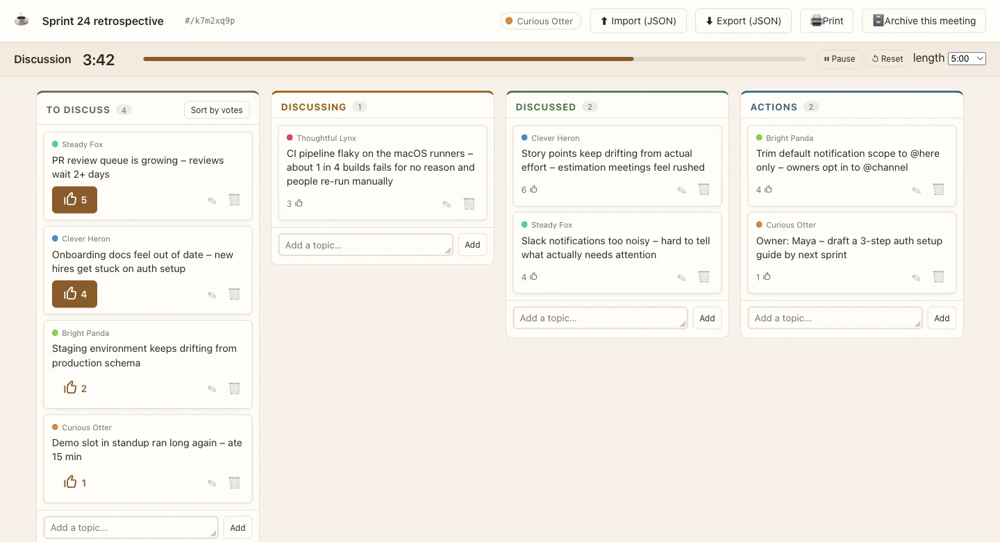

# ☕ Lean Coffee Board

A simple, real-time collaborative board for **Lean Coffee** style meetings – agenda-less, time-boxed discussions where participants suggest topics, vote, and discuss in priority order. Inspired by the now-offline *Agile Coffee* tool.

Four-column Kanban: **To Discuss → Discussing → Discussed → Actions**. Drag cards horizontally between columns and vertically to reorder. Share a link, no accounts required.



---

## Features

- **Real-time sync** – everyone on the same URL sees cards move, votes update, and the timer tick together.
- **Drag-and-drop** – move cards between columns (horizontal) and reorder within a column (vertical).
- **Unique meeting URLs** – each board gets an 8-character hash URL, e.g. `#/a1b2c3d4`.
- **Voting** – 3 votes per person (Lean Coffee standard) to prioritise the To Discuss column. One click to sort by votes.
- **Synced discussion timer** – start, pause, reset; pick from 2–15 minute lengths. Every client computes remaining time from server timestamps, so it stays in sync without a ticking server.
- **Random identity** – each browser gets a friendly name + colour (e.g. "Curious Otter"), so cards are attributable without accounts.
- **Markdown topics** – card text supports `**bold**`, `*italic*`, `~~strikethrough~~`, `` `code` ``, fenced code blocks, links like `[text](https://…)` and autolinks like `<https://…>`. Rendered by a small built-in formatter: input is HTML-escaped first and only `https:`/`mailto:` links are allowed, so card text can never inject HTML.
- **Card selection** – click a topic to highlight it for everyone in real time, so the audience always sees which topic is on the table. Click again to deselect, or another topic to switch.
- **Archive** – when the meeting is over, **Archive this meeting** locks the board: editing is disabled across the app and rejected by the database, and everyone sees a banner with a one-click **Restore this meeting from the archive** button (timer state included). Permanently deleting a meeting stays a maintenance task – see [Maintenance](#maintenance).
- **Export & import** – download the board as JSON, print a clean summary (decisions and action items highlighted), and import topics from a previous export. Importing appends to the current board and never touches existing cards.
- **No build step** – plain HTML/CSS/JS served as-is.

## How it works

```
Browser (GitHub Pages)              Supabase (free tier)
┌─────────────────────┐            ┌──────────────────────┐
│ index.html          │            │ Postgres             │
│ css/style.css       │◀──────────▶│  ├ boards            │
│ js/*.js (modular)   │  Realtime  │  └ cards             │
│ supabase-js (CDN)   │  channels  │ RLS (anon read/write)│
└─────────────────────┘            │ Realtime enabled     │
                                   └──────────────────────┘
```

- The frontend is hosted on **GitHub Pages** and uses **hash-based routing**, so no SPA redirect tricks are needed.
- **Supabase** provides the Postgres database, Row Level Security, and Realtime channels. The frontend talks to it directly via `supabase-js`.
- The Supabase **anon key** is intentionally public (committed to the repo) – access is governed by RLS, not key secrecy. The board slug acts as a capability URL: anyone with the link can edit.
- **Keep-alive:** on the free tier, Supabase pauses projects after **1 week of API inactivity**. The [`.github/workflows/keep-alive.yml`](.github/workflows/keep-alive.yml) workflow pings the REST API every 5 days (and on manual dispatch) so the project never pauses. It does a read-only `boards` query and never mutates data. If you fork, update the `SUPABASE_URL` and `SUPABASE_ANON_KEY` in the workflow to match your own project (they're committed on purpose – the anon key is safe to expose).

---

## Setup

### 1. Create a Supabase project

1. Sign up at [supabase.com](https://supabase.com) (free tier).
2. Create a new project. Note the **Project URL** and **anon public key** from *Project Settings → API*.
3. Open the **SQL Editor** and paste the contents of [`supabase/schema.sql`](supabase/schema.sql). Run it. This creates the `boards` and `cards` tables, enables RLS with public read/write policies, and adds both tables to the Realtime publication.

### 2. Configure the app

Edit [`js/config.js`](js/config.js) and replace the placeholders:

```js
export const SUPABASE_URL = 'https://YOUR_PROJECT.supabase.co';
export const SUPABASE_ANON_KEY = 'YOUR_ANON_KEY';
```

### 3. Push to GitHub and enable Pages

1. Push the repo to your own GitHub, e.g. `https://github.com/<your-user>/lean-coffee-board`.
2. In the repo: **Settings → Pages → Source = "Deploy from a branch"**, branch `main`, folder `(root)`. Save.
3. Your board will be live at `https://<your-user>.github.io/lean-coffee-board/`. Each push to `main` auto-deploys. The app uses hash-based routing and relative asset paths, so it also deploys unchanged under any static host or custom domain – no site-specific config needed.

### 4. Run locally

```bash
git clone https://github.com/<your-user>/lean-coffee-board.git ~/repo/lean-coffee-board
cd ~/repo/lean-coffee-board
python3 -m http.server 8000
# open http://localhost:8000
```

---

## Running a Lean Coffee meeting

1. Open the app and click **Start a new board**.
2. Copy the URL (it contains the `#/slug`) and share it with participants.
3. Everyone adds topics to the **To Discuss** column.
4. Each person spends their 3 votes (▲) on the topics they want to prioritise. Click **Sort by votes** to reorder.
5. Drag the top topic to **Discussing**, start the timer, and click the card to highlight it for the room.
6. When the timer ends, the group decides: continue (restart timer) or done (drag to **Discussed**). Capture decisions and next steps in the **Actions** column.
7. Repeat until time runs out.
8. Use **Print** to capture a summary, or **JSON** to export the raw board.
9. When the meeting is over, click **Archive this meeting** – the board becomes read-only for everyone, with a banner offering a one-click restore (permanent deletion goes through the maintenance script).

---

## Project structure

```
lean-coffee-board/
├── index.html                  # App shell
├── css/style.css               # Board, cards, columns, responsive
├── js/
│   ├── config.js               # Supabase URL + anon key (edit this)
│   ├── supabase.js             # Client + realtime subscriptions
│   ├── app.js                  # Hash router, landing page
│   ├── board.js                # State, CRUD, rendering
│   ├── dnd.js                  # Drag-and-drop (horizontal + vertical)
│   ├── timer.js                # Synced discussion timer
│   ├── voting.js               # 3-votes-per-person + sort by votes
│   ├── identity.js             # Random name/colour, per browser
│   ├── markdown.js             # Safe Markdown subset for topic text
│   └── export.js               # JSON + print export
├── supabase/schema.sql         # Tables, RLS (incl. archive lock), realtime (run once)
├── supabase/maintenance.sql    # last_activity, constraints, board_overview view (run once)
├── supabase/archive.sql        # Archiving: columns, lock policies, view update (run once)
├── scripts/
│   └── maintenance.mjs         # Content-blind monitoring & cleanup CLI
├── .nojekyll                   # Disable Jekyll processing on Pages
└── examples/                   # Sample board screenshot + demo HTML source
```

---

## Maintenance

Boards live in Supabase until deleted, and under the open-RLS model every board that exists is world-readable – so old meetings are worth cleaning up. The tooling is metadata-only by design: it shows each board's title, timestamps and card/vote counts, never card text or author names.

**One-time setup:** run [`supabase/maintenance.sql`](supabase/maintenance.sql) and [`supabase/archive.sql`](supabase/archive.sql) in the Supabase SQL Editor (after `schema.sql`; all re-runnable). `maintenance.sql` adds a trigger-maintained `boards.last_activity_at` column, integrity check constraints, and a `board_overview` view; `archive.sql` adds board archiving – the `boards.archived` column, policies that lock card writes on archived boards, and a trigger that makes archived board rows immutable except for restoring them. Projects set up before archiving existed need `archive.sql` before the archive commands (and the in-app button) work.

**Monitoring:** query the view whenever, e.g. in the SQL Editor:

```sql
select * from board_overview order by last_activity_at desc;
```

or from the terminal (`list` fetches the same view – never card content):

```bash
bun scripts/maintenance.mjs list               # or: node scripts/maintenance.mjs list
bun scripts/maintenance.mjs list --json
```

**Cleanup:** prune is dry-run by default; `--apply` is required to delete anything. Deletion removes whole boards – cards cascade with them.

```bash
bun scripts/maintenance.mjs prune --older-than 90d            # dry run: shows what would go
bun scripts/maintenance.mjs prune --older-than 90d --apply    # actually deletes
```

- `--older-than <age>` – boards with no writes for this long (e.g. `48h`, `90d`, `2w`; minimum 1h).
- `--empty-age <age>` – never-used boards (zero cards) are deleted after this age instead; default `1d`, `0` disables.
- `--archive DIR` – (with `--apply`) saves each board first as JSON in the app's own export format, so it can be re-imported later. This is the one feature that reads card content, which is why it is opt-in.

**What counts as activity:** any write to a board or its cards – timer runs, title edits, added topics, votes, card moves. Reads never count (the keep-alive workflow does not keep boards alive).

**Archiving, restoring and deleting a single meeting** – also dry-run by default, `--apply` required to change anything:

```bash
bun scripts/maintenance.mjs archive a1b2c3d4             # dry run: shows what would be archived
bun scripts/maintenance.mjs archive a1b2c3d4 --apply     # actually archives
bun scripts/maintenance.mjs unarchive a1b2c3d4           # dry run: shows what would be restored
bun scripts/maintenance.mjs unarchive a1b2c3d4 --apply   # actually restores
bun scripts/maintenance.mjs delete a1b2c3d4              # dry run: shows what would be deleted
bun scripts/maintenance.mjs delete a1b2c3d4 --apply      # actually deletes
```

`archive` makes the board read-only for everyone and stops a running timer (its elapsed time is kept, so restoring resumes where the meeting left off). `delete` permanently removes one board – cards cascade with it – and accepts `--archive DIR` (with `--apply`) to save a JSON backup first, exactly like `prune`. Archived boards are never touched by `prune`; they stay until deleted explicitly.

The script takes its Supabase URL and anon key from `SUPABASE_URL`/`SUPABASE_ANON_KEY` env vars, falling back to [`js/config.js`](js/config.js). If a check constraint fails to apply during the one-time setup, some existing row violates it – the error names the constraint; fix the data or relax the rule and re-run the migration.

---

## Security model & tradeoffs

This is a **no-account** tool, matching the philosophy of the original Agile Coffee. The tradeoffs are inherent:

- **The board URL is the only secret.** Anyone with the link can read and edit the board. The 8-character slug gives ~4 billion combinations – enough that unguessable URLs won't be found by chance, but treat board links as sensitive as the meeting itself.
- **Votes are best-effort.** The 3-vote limit is enforced per-browser via `localStorage`, not globally. A determined user could clear storage to vote again. True enforcement requires accounts, which this project deliberately avoids.
- **RLS is open for live boards** (public read/write on both tables – necessary for the no-account model). This means any Supabase client pointing at your project URL can read/write any live board; the slug is the access control. **Archived boards are locked in the database itself:** card writes require an un-archived parent board, and an archived boards row rejects every update except the restore. Restoring is open to anyone with the URL – restoring is consistent with the capability model.

If you need stronger access control, fork the project and add Supabase Auth.

## License

MIT – see [LICENSE](LICENSE).
